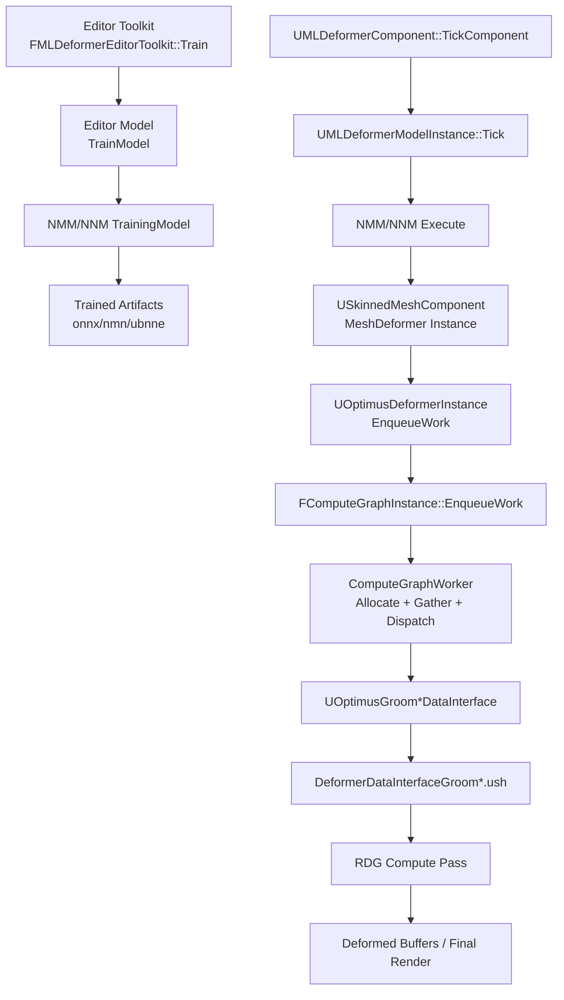
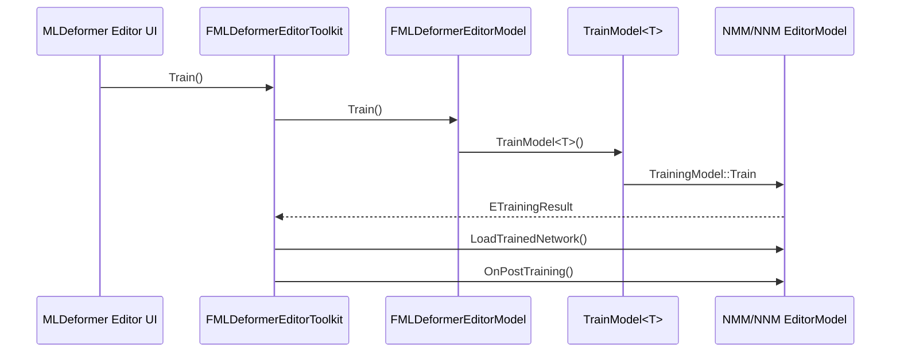
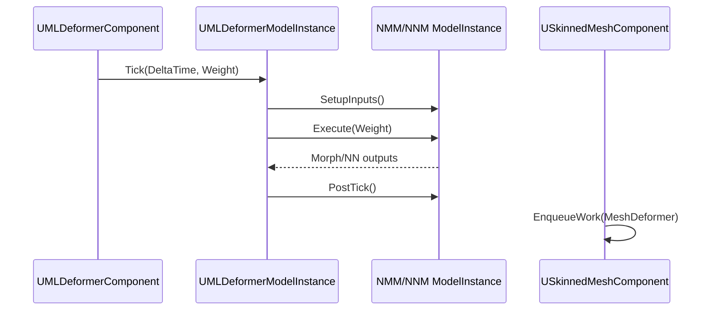
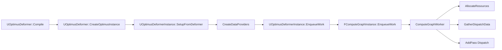
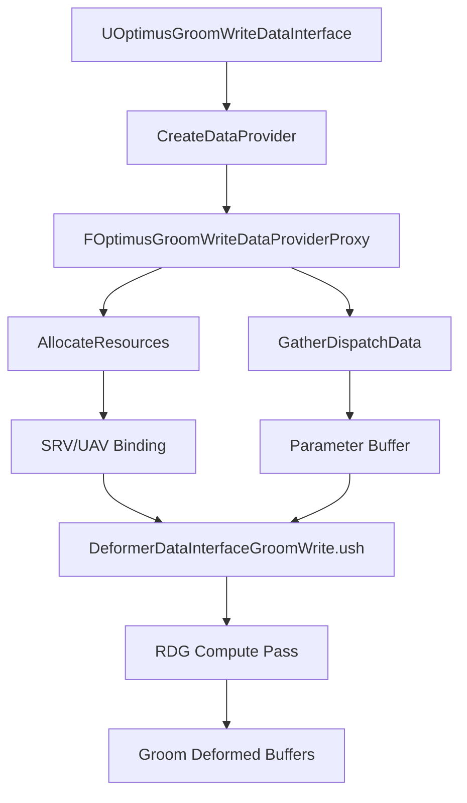

# UE5 MLDeformer 架构图总结（Architecture Diagram）

> 基线：`UE_ROOT = D:/UE/UnrealEngine`，`EngineAssociation = 5.5`

## 1. 总体分层架构图

## 2. 训练链时序图（Editor）

## 3. 推理链时序图（Runtime）

## 4. Compute 调度图（Optimus / ComputeFramework）

## 5. Groom 写回图（DataInterface -> Shader）

## 6. 性能与观测点（架构视角）
1. CPU 推理入口：`STAT_MLDeformerInference`（`UMLDeformerComponent::TickComponent`）。
2. 模型分支：
   - NMM：`CSV_SCOPED_TIMING_STAT(MLDeformer, NeuralMorphExecute)`
   - NNM：`CSV_SCOPED_TIMING_STAT(MLDeformer, NearestNeighborExecute)`
3. Compute 层：`ComputeGraphWorker` 的统一分发与 fallback 路径。
4. Groom 层：`AllocateResources` / `GatherDispatchData` 参数和缓冲绑定一致性。

## 7. 与文档体系的关系
- 分层解析：`docs/02_code_map/deep_dive/`
- 逐行核心解析：`docs/02_code_map/core_line_by_line/README_Core_LineByLine_Index_CN.md`
- 模型专题映射：NMM / NNM / Groom 三篇专题文档
