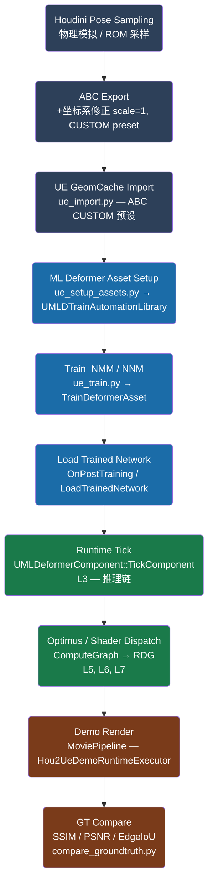

# UE5 ML Deformer —— 新手导航文档

> **目标读者**：零基础用户，从未接触过 ML Deformer / Houdini 自动化管线。  
> **UE 版本**：5.5 · 模型范围：Neural Morph Model (NMM)、Nearest Neighbor Model (NNM)、Groom Deformer  
> 完整文档树见 [INDEX.md](INDEX.md)。

---

## 目录

- [一、什么是 ML Deformer](#一什么是-ml-deformer)
- [二、数据流总览](#二数据流总览)
- [三、模块介绍](#三模块介绍)
- [四、使用 Skill](#四使用-skill)
- [五、从 0 到 1：快速上手](#五从-0-到-1快速上手)
- [六、文档索引](#六文档索引)

---

## 一、什么是 ML Deformer

**ML Deformer（机器学习变形器）** 是 UE5 的一套插件系统，用机器学习网络在运行时实时预测骨骼动画之外的次级形变（肌肉鼓起、衣物褶皱、头发形态等）。它的思路是：

1. 离线用物理模拟（Houdini Vellum / FEM）生成高精度形变数据集；
2. 用该数据集训练一个轻量神经网络；
3. 游戏运行时每帧用骨骼姿势驱动网络推理，输出叠加到蒙皮结果上。

本仓库是一套**可复用的工程化学习体系**，包含：
- 完整的理论 → 源码 → 数据 → 训练 → 推理 文档链；
- 一条 Houdini → UE5 全自动化管线（`pipeline/hou2ue/`）；
- 一套独立的原型验证闭环（`prototype/`，WSL 训练 + Windows 推理）；
- 五个可直接调用的 Copilot Agent Skill。

---

## 二、数据流总览

下图描述整条管线的数据流（从 Houdini 物理模拟到最终质量对比）。  
`pipeline/hou2ue/run_all.ps1` 自动驱动所有阶段；若使用 `skip_train` 模式，则跳过前 4 个阶段直接从已验证 `.uasset` 开始。



**颜色说明**

| 颜色 | 阶段 |
|------|------|
| 深蓝 | 离线数据制作（Houdini + UE Import） |
| 中蓝 | 资产配置 + 训练 |
| 绿色 | 运行时推理（Runtime） |
| 棕色 | 渲染 + 质量评估 |

> **skip\_train 捷径**：`skip_train: true` 时，直接从 `Refference/` 复制已验证的三个 `.uasset` 文件，跳过 A→E 五个阶段，节省约 30% 时间（23 min vs 33 min）。验证结果：SSIM_mean = 0.9997，PSNR_min = 52.28，EdgeIoU = 0.9875。

---

## 三、模块介绍

| 模块 | 职责 | 关键文件 | 入口文档 |
|------|------|----------|----------|
| **MLDeformerFramework**<br>（UE 插件核心） | 提供 `UMLDeformerComponent`、`UMLDeformerModel`、`UMLDeformerModelInstance` 基类及 Optimus 集成；所有推理逻辑的起点 | `Plugins/MLDeformerFramework/` (UE 引擎目录) | [理论总览](01_theory/README_MLDeformer_Groom_Theory_CN.md) · [主链路](02_code_map/README_UE5_CodeMap_Mainline_CN.md) |
| **MLDeformerSample**<br>（Runtime C++ 模块） | 项目自定义 GameMode；向 Blueprint UI 暴露实时性能统计（推理耗时、GPU / Runtime 内存）；管理三个 `UMLDeformerAsset` 引用 | `Source/MLDeformerSample/` | [逐行分析 Component](02_code_map/core_line_by_line/README_Core_01_MLDeformerComponent_CN.md) |
| **MLDeformerSampleEditorTools**<br>（Editor C++ + Python bridge） | 提供 `UMLDTrainAutomationLibrary`（4 个 `BlueprintCallable` 函数）；Python 管线脚本通过 UE 内置 Python API 调用此库来配置 / 训练 / dump 资产 | `Source/MLDeformerSampleEditorTools/` | [L2 训练链](02_code_map/deep_dive/README_L2_Editor_Train_CN.md) |
| **pipeline/hou2ue**<br>（自动化管线脚本集） | 11 个 Stage 的端到端自动化：Houdini cook → ABC 导出 → UE import → 资产配置 → 训练 → 推理 → 渲染 → 质量对比 → 汇总报告；PowerShell 编排 + 17 个 Python 脚本 | `pipeline/hou2ue/run_all.ps1`<br>`pipeline/hou2ue/scripts/`<br>`pipeline/hou2ue/config/pipeline.yaml` | [训练推理实操](04_train_infer/README_UE5_MLDeformer_TrainInfer_CN.md) |
| **prototype/**<br>（独立原型闭环） | 脱离 Houdini / UE Editor 的轻量训练验证环境；WSL 侧运行 NMM/NNM/Groom smoke 训练，Windows 侧推理 + Jupyter 可视化；用于跨平台环境验证 | `prototype/scripts/run_all.ps1`<br>`prototype/config/pipeline.defaults.yaml` | [prototype README](../prototype/README.md) |

---

## 四、使用 Skill

Skill 是可直接在 Copilot Agent 中调用的标准化操作单元。  
**调用方式**：在对话中引用 `@workspace /docs/05_skill_analogy/skill-<name>/SKILL.md`，Agent 会按照 SKILL.md 中定义的步骤执行。

| Skill | 触发场景 | 文件 |
|-------|----------|------|
| **ue5-mldeformer-train** | 需要在 UE5 中完整执行训练到推理验证流程，或排查训练失败 | [SKILL.md](05_skill_analogy/skill-ue5-mldeformer-train/SKILL.md) |
| **ue5-groom-deformer-debug** | Groom 变形不生效、DataInterface 绑定报错、头发闪烁等 Groom 专属问题 | [SKILL.md](05_skill_analogy/skill-ue5-groom-deformer-debug/SKILL.md) |
| **prototype-data-acquisition** | 首次获取公开/门控数据集，构建 `dataset_manifest.jsonl` | [SKILL.md](05_skill_analogy/skill-prototype-data-acquisition/SKILL.md) |
| **prototype-wsl-train-orchestrator** | 在 WSL 环境下对 NMM / NNM / Groom 进行 smoke 训练，生成 `train_report.json` | [SKILL.md](05_skill_analogy/skill-prototype-wsl-train-orchestrator/SKILL.md) |
| **prototype-win-infer-viz** | Windows 侧推理 + Jupyter 可视化，输出误差/延迟折线图 | [SKILL.md](05_skill_analogy/skill-prototype-win-infer-viz/SKILL.md) |

> Skill 的设计逻辑和触发矩阵详见 [Skill 类比矩阵](05_skill_analogy/README_Skill_Analogy_Matrix_CN.md)。

---

## 五、从 0 到 1：快速上手

### Phase 0 · 前提条件

| 工具 | 版本要求 | 说明 |
|------|----------|------|
| Unreal Engine | 5.5 | 需启用插件：`ML Deformer Framework`、`Neural Morph Model`、`Nearest Neighbor Model`、`Groom`、`Optimus` |
| Houdini | 20.0.625（仅完整管线需要） | 执行 Vellum / FEM 物理模拟并导出 ABC |
| Python | 3.11（Windows） | 管线脚本依赖；UE 内置 Python 已包含，pipeline 脚本额外依赖见 `pipeline/hou2ue/config/pipeline.yaml` |
| Git LFS | 任意 | 大文件（`.uasset`、ABC 缓存）通过 LFS 管理 |
| WSL2（仅 prototype 需要） | Ubuntu 22.04 推荐 | prototype 训练环境；完整 hou2ue 管线不需要 WSL |

### Phase 1 · 克隆 + 打开项目

```powershell
git lfs install
git clone <repo-url> "D:\UE\Unreal Projects\MLDeformerSample"
```

1. 双击 `MLDeformerSample.uproject` 用 UE 5.5 Editor 打开（首次需编译 C++ 模块，约 5 min）；
2. 打开 `编辑 → 插件`，确认以下插件已启用并重启：
   - `ML Deformer Framework` · `Neural Morph Model` · `Nearest Neighbor Model`
   - `Geometry Cache` · `Groom` · `Optimus`
3. 编译 C++ 模块（`MLDeformerSample` + `MLDeformerSampleEditorTools`）：

```powershell
# 或直接在 VS 中 Build（Development Editor | Win64）
.\MLDeformerSample.sln
```

### Phase 2 · 快速验证（skip\_train 路径，≈ 23 min）

> **推荐新手入门路径**：无需 Houdini，无需训练，直接使用 `Refference/` 中已验证的资产；  
> 验证结果：SSIM = 0.9997 · PSNR = 52.28 · EdgeIoU = 0.9875（来源：[checkpoint-20260226](memory/checkpoint-20260226-full-validation-and-optimizations.md)）。

**步骤**：

1. 编辑 `pipeline/hou2ue/config/pipeline.yaml`，将 `ue.training.skip_train` 设为 `true`；
2. 在 PowerShell 中运行：

```powershell
cd "D:\UE\Unreal Projects\MLDeformerSample"
.\pipeline\hou2ue\run_all.ps1 -Stage full -Profile smoke
```

3. 等待约 23 min，检查输出：

```
pipeline\hou2ue\runs\<timestamp>\pipeline_report_latest.json
pipeline\hou2ue\runs\<timestamp>\gt_compare\
```

4. 确认报告中 `overall_pass: true` 且以下指标达标：

| 指标 | 通过阈值 |
|------|----------|
| `ssim_mean` | ≥ 0.995 |
| `psnr_min` | ≥ 50 |
| `edge_iou` | ≥ 0.97 |

### Phase 3 · 完整管线（含 Houdini 训练，≈ 33 min）

> 需要已安装 Houdini 20.0.625，且 `pipeline.yaml` 中路径配置正确。

1. 将 `ue.training.skip_train` 改回 `false`，设置 `training_data_source: pipeline`；
2. 确认 `pipeline.yaml` 中 `houdini_path`、`ue_editor_path`、`python_path` 三个路径正确；
3. 运行：

```powershell
.\pipeline\hou2ue\run_all.ps1 -Stage full -Profile smoke
```

流程依次执行：`baseline_sync → preflight → houdini → convert → ue_import → ue_setup → train → infer → gt_reference_capture → gt_source_capture → gt_compare → report`

4. 宽松指标（pipeline 训练因 GPU 非确定性，数值略低于 skip_train）：SSIM ≥ 0.60 · PSNR ≥ 15 · EdgeIoU ≥ 0.40；
5. 若训练 SSIM 未达严格阈值（≥ 0.995），参考 [训练确定性治理](04_train_infer/README_UE5_MLDeformer_TrainInfer_CN.md) 或回退到 Phase 2（skip_train）。

### Phase 4 · 查看结果

- **管线报告**：`pipeline_report_latest.json`（每阶段耗时 + 指标 + pass/fail）
- **渲染截图**：`gt_compare/` 目录下 Source vs Reference 对比帧（PNG）
- **性能统计**：在 UE Editor 中打开关卡 `Content/Maps/`，运行时 `stat MLDeformer` 查看推理耗时
- **调试问题**：见 [Profiling & Debug](04_train_infer/README_Profiling_And_Debug_CN.md)

---

## 六、文档索引

完整文件树见 **[INDEX.md](INDEX.md)**。各子目录职责速查：

| 目录 | 内容描述 |
|------|----------|
| [01_theory/](01_theory/) | ML Deformer 理论基础（LBS → NMM → NNM 演进）+ NMM / NNM / Groom 横向对比表 |
| [02_code_map/](02_code_map/) | UE5 源码主链路 · 架构 Mermaid 图 · 7 层 Top-Down 深度解析 · 核心文件逐行注释 |
| [03_dataset_pipeline/](03_dataset_pipeline/) | Houdini → UE 数据集完整制作流程 · ABC 坐标系陷阱 · 数据质量 QC Checklist |
| [04_train_infer/](04_train_infer/) | 训练操作步骤 · skip_train 模式 · 推理链 · Profiling & Debug 指南 |
| [05_skill_analogy/](05_skill_analogy/) | Skill 类比矩阵 · 5 个 Agent-invokable SKILL.md · Prototype 闭环总结 |
| [06_appendix/](06_appendix/) | UE5 源码 7 层符号索引（含 `rg` 搜索命令） |
| [memory/](memory/) | 阶段性进度检查点（skip_train 验证 · unified pipeline · 完整验证 P1–P5） |

---

## 附：字段约定

文档中的表格遵循以下字段模式（供二次开发参考）：

| 字段集 | 字段名 |
|--------|--------|
| 理论-源码映射 | `concept \| paper_ref \| ue_module \| file_path \| symbol \| train_or_infer \| explanation \| validation` |
| 分层架构 | `layer \| parent_symbol \| child_symbol \| file_path \| thread_context \| data_carrier \| failure_point \| probe` |
| 逐行注释 | `line_range \| code_focus \| explanation \| breakpoint_probe` |
| Skill 定义 | `name \| description \| trigger \| prerequisites \| steps \| outputs \| failure_modes \| verification` |
