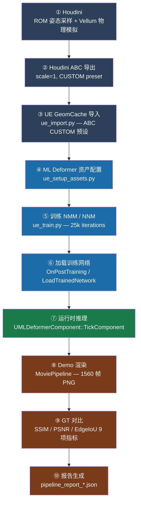

# MLDeformerSample 零基础导航指南

> **目标读者**：从未接触过 ML Deformer、Houdini 自动化管线的零基础用户  
> **版本**：UE 5.5（主分支）+ UE 5.7（`UE57/` 子目录）  
> **更新日期**：2026-03-09

> **最新里程碑**：已新增 [Refference(UE5.5) Local vs Global 自对照](../milestones/milestone-20260312-reference-local-vs-global-5.5.md)。它确认了两件事：一是 Refference 5.5 中 `Local` 和 `Global` 都健康；二是关键 Houdini 训练动画与 GeomCache 在 `Refference/` 和 `UE57/` 两边内容一致。当前主目标是继续定位 UE5.7 的实现差异。

---

## 目录

1. [本工程是什么，能学到什么](#1-本工程是什么能学到什么)
2. [ML Deformer 理论人话版](#2-ml-deformer-理论人话版)
3. [工程目录结构总览](#3-工程目录结构总览)
4. [数据流全景图](#4-数据流全景图)
5. [Houdini 部分详解](#5-houdini-部分详解)
6. [UE 部分详解](#6-ue-部分详解)
7. [自动化管线使用](#7-自动化管线使用)
8. [如何阅读本项目文档](#8-如何阅读本项目文档)
9. [常见问题 Q&A](#9-常见问题-qa)
10. [快速索引表](#10-快速索引表)

---

## 1. 本工程是什么，能学到什么

这个仓库是一套**可复用的 ML Deformer 工程化学习体系**，以 UE5 角色 Emil 为载体，演示从物理模拟到 AI 推理的完整技术链条。

**你可以用它来：**

| 目的 | 使用方式 |
|------|----------|
| 学习 ML Deformer 技术原理 | 阅读 `docs/01_theory/` 理论文档 |
| 理解 NMM/NNM 代码实现 | 阅读 `docs/02_code_map/` 源码分析 |
| 运行完整的自动化训练验证管线 | 执行 `pipeline/hou2ue/run_all.ps1` |
| 用 Copilot AI 辅助开发 | 调用 `docs/05_skill_analogy/` 中的 Skill |
| 查看历史调试记录 | 阅读 `docs/memory/` checkpoint 文件 |
| 了解项目阶段性突破 | 阅读 `docs/milestones/` 里程碑文档 |

**你不需要提前会：** Houdini 操作、UE C++ 开发、机器学习数学——文档会逐步引导你。

---

## 2. ML Deformer 理论人话版

### 2.1 骨骼蒙皮（LBS）的问题

游戏中角色动画的标准方案是**线性蒙皮（LBS）**：每个顶点被若干骨骼影响，骨骼运动 → 顶点跟着移动。  
LBS 快速且稳定，但存在天然缺陷：

- **糖果纸效应**：手肘、肩膀弯曲时，关节处不自然地挤扁或拉伸
- **无次级形变**：肌肉在不同姿态下的鼓起、脂肪的抖动、衣物的褶皱——LBS 完全无法表达

如果只用 LBS，角色的皮肤和衣物在激烈运动时就会看起来像是橡皮玩具。

### 2.2 物理模拟很精确，但太慢

Houdini 的 Vellum（布料）和 FEM（有限元）可以精确模拟次级形变，但每帧需要数秒到数分钟计算，无法实时运行。

### 2.3 ML Deformer 的解法

训练一个神经网络，用**骨骼姿态**预测**次级形变偏移量**：

```
骨骼旋转（每帧 ~80 个骨骼） → 神经网络推理 → 顶点偏移量 → 叠加到 LBS 结果
```

- **离线阶段**：用物理模拟器生成大量"姿态 → 形变"样本对用于训练
- **运行时**：每帧仅做一次轻量网络推理（毫秒级）

### 2.4 NMM vs NNM 的区别

本项目用到两种模型，各司其职：

| 特性 | NMM（Neural Morph Model） | NNM（Nearest Neighbor Model） |
|------|--------------------------|-------------------------------|
| **用途** | 上半身肌肉/皮肤次级形变 | 服饰（上装/下装）的次级形变 |
| **原理** | 学习全局 PCA 形态基，线性组合 | 最近邻检索训练样本，插值混合 |
| **速度** | 较快（矩阵乘法） | 极快（向量距离查找） |
| **精度** | 适合连续光滑形变 | 适合离散折叠/接触形变 |
| **模型大小** | ~200–300 MB（`global` 模式） | ~260–830 MB |
| **关键参数** | `mode: global`，`global_num_morph_targets: 128` | `num_neighbors`，`num_pca_components` |

> **重要边界**：不要把历史 UE5.7 分支上的经验过度泛化成“Local 一定错、Global 一定对”。
> 在 `Refference + UE5.5` 的最新自对照里，`Local` 和 `Global` 都能得到很高质量结果；此前“必须显式切到 Global”只适用于当时那个 UE5.7 Phase V 排障分支，而不是对所有工程/版本都成立的定律。

### 2.5 一个这次项目里非常重要的实战经验

Phase W 最有价值的经验，不是“NNM 指标更高”，而是**你要先判断问题到底是‘统一容量不够’，还是‘局部姿态簇缺少补偿机制’**。

这次我们连续做了两个对照方向：

| 方案 | 思路 | 结果 | 说明 |
|------|------|------|------|
| W-3A 受限 Local | 给每骨骼极小局部容量（`local_num_morph_targets_per_bone=1`） | `ssim_mean=0.5550` | 不是略差，而是整体表达能力直接不够 |
| W-3B NNM | 用基础网络 + 相似姿态近邻融合补局部细节 | `ssim_mean=0.9960` | 把主瓶颈窗口 `0588–0597 / 0600–0699` 直接修平 |

为什么差距会这么大：

1. W-2C 已证明继续增大 Global NMM 容量几乎不涨 `ssim`，所以瓶颈不在“全局网络太小”。
2. W-3A 的受限 Local 本质是在**削减表达能力**，会把问题从“局部误差”放大成“整体退化”。
3. W-3B NNM 则是在**保留基础预测的同时，对相似姿态做邻域细节补偿**，刚好命中连续局部姿态簇误差。

这条经验以后可以复用成一个简单判断：

- 如果误差是全身普遍性的，优先怀疑数据质量、全局容量或训练流程。
- 如果误差集中在少量连续帧、局部部位、特定姿态簇，优先考虑 **NNM / retrieval-style 补偿**，而不是盲目继续扩大全局 NMM 或把 Local 容量压得过低。

---

## 3. 工程目录结构总览

```
MLDeformerSample/
│
├── Source/                     ← C++ 源码
│   ├── MLDeformerSample/           Runtime 模块（GameMode、性能统计 UI）
│   └── MLDeformerSampleEditorTools/  Editor 模块（训练自动化库）
│
├── Content/                    ← UE 资产
│   └── Characters/Emil/
│       ├── Deformers/              ← NMM/NNM .uasset 文件（训练产出）
│       ├── GeomCache/MLD_Train/    ← 物理模拟导出的 Geometry Cache
│       └── Animation/MLD_train/   ← 配套骨骼动画序列
│
├── pipeline/hou2ue/            ← 自动化管线（核心）
│   ├── run_all.ps1                 ← 主入口：一键运行所有阶段
│   ├── config/
│   │   ├── pipeline.yaml           ← 基础配置（路径、阈值）
│   │   └── pipeline.full_exec.yaml ← 完整执行配置（含训练超参）
│   ├── scripts/                    ← 各阶段 Python 脚本（17 个）
│   └── workspace/                  ← 运行产出（runs/、logs、报告）
│
├── Refference/                 ← Epic 原始参考工程（只读）
│   └── Content/Characters/Emil/Deformers/  ← 预训练模型（306 MB，黄金基准）
│
├── docs/                       ← 文档体系（本文所在目录）
│   ├── README.md                   ← 文档总入口（从这里开始）
│   ├── 01_theory/                  ← 理论文档
│   ├── 02_code_map/                ← 源码分析
│   ├── 03_dataset_pipeline/        ← 数据制作流程
│   ├── 04_train_infer/             ← 训练推理实操
│   ├── 05_skill_analogy/           ← Copilot Skill（可直接调用）
│   ├── operation/                  ← Agent 操作机理（如何解析 HIP / UE、如何串联双软件、如何调试）
│   ├── guide/                      ← 新手导航（本文件）
│   ├── milestones/                 ← 里程碑记录
│   ├── memory/                     ← 历史 checkpoint（调试记录）
│   └── plan/                       ← 实验计划
│
├── prototype/                  ← 独立原型环境（WSL 训练 + Win 推理）
└── UE57/                       ← UE 5.7 git worktree（仅作版本对比参考，非训练路径）
```

> ⚠️ **重要路径说明**：本仓库的 `UE57/` 子目录（`...MLDeformerSample\UE57\`）是 **git worktree 参考副本**，
> 其 `Content/Characters/Emil/Deformers/` 中的 `.uasset` 文件为历史旧版（2 月 2 日），**不是最新训练产出**。  
> 实际训练在独立工程路径 `D:\UE\Unreal Projects\UE57\MLDeformerSample\` 执行，该路径下的模型才是最新版本。  
> 详见 [Q8：两个 UE57 路径有什么区别？](#q8两个-ue57-路径有什么区别)

```
MLDeformerSample/
```

---

## 4. 数据流全景图

### 4.1 全流程 Mermaid 图



### 4.2 各阶段说明

| 阶段 | 脚本 / 工具 | 输入 | 输出 | 耗时参考 |
|------|-------------|------|------|----------|
| ① Houdini 物理模拟 | Houdini Vellum / PDG | `.hip` 文件 | Alembic `.abc` | 数小时（离线） |
| ② ABC 导出 | `houdini_export_abc.py` | Houdini scene | `.abc` 文件 | 数分钟 |
| ③ GeomCache 导入 | `ue_import.py` | `.abc` | `.uasset` GeomCache | ~2 min |
| ④ 资产配置 | `ue_setup_assets.py` | `.uasset` 模板 | 配置好的 Deformer 资产 | ~1 min |
| ⑤ 训练 | `ue_train.py` | GeomCache + 动画 | 训练后 `.uasset`（NMM 207 MB） | ~16 min |
| ⑥ 加载 | 自动（UE Editor） | 训练产出 | 网络权重加载到内存 | 即时 |
| ⑦ 推理 | UE Runtime | 骨骼姿态 | 顶点偏移向量 | < 1 ms/帧 |
| ⑧ 渲染 | `ue_capture_mainseq.py` | Main_Sequence | 1560 帧 PNG | ~30 min |
| ⑨ GT 对比 | `compare_groundtruth.py` | source + reference PNG | per-frame 指标 JSON | ~5 min |
| ⑩ 报告 | `build_report.py` | per-frame 指标 | `pipeline_report_*.json` | < 1 min |

### 4.3 skip_train 快捷通道

如果你只想验证管线本身、不想重新训练，可以启用 **skip_train** 模式：  
直接使用 `Refference/` 中 Epic 预训练的 306 MB 模型，跳过阶段 ①–⑤，约省 30% 时间。

> **术语说明**：后文出现 `Refference` / `Reference` 时，需要区分它究竟是在说参考工程目录、从参考工程复制出的预训练资产，还是 GT 对比中的 reference 侧帧。只有写成 `Refference/` 时，才明确指目录本身。

```yaml
# pipeline.yaml 或 pipeline.full_exec.yaml
ue:
  training:
    skip_train: true
```

验证结果：ssim = 0.9997，psnr_min = 52.28，均远超阈值。

---

## 5. Houdini 部分详解

### 5.1 Houdini 在流程中做什么

Houdini 负责**生成训练数据**（即"告诉 AI 每种姿态下肌肉和衣物应该长什么样"）：

1. **ROM 姿态采样**：通过 PDG 自动生成 5000+ 个覆盖广泛的骨骼姿态
2. **Vellum 布料模拟**：对每个姿态用物理引擎计算衣物形变
3. **FEM / 肌肉模拟**：对皮肤/肌肉层计算次级形变
4. **导出 Alembic**：将每一帧的顶点位置输出为 `.abc` 格式供 UE 导入

### 5.2 关键导出设置（ABC 导出）

在 Houdini 中导出 Alembic 时，**以下两个参数必须正确**，否则 UE 导入后顶点坐标会出错：

| 参数 | 正确值 | 错误后果 |
|------|--------|----------|
| `scale` | **1.0** | 单位不匹配，顶点偏移 × 100 |
| `transform preset` | **CUSTOM**（不使用 Maya/Max 预设） | 坐标系翻转，导致形变方向错误 |

```
Houdini ROP Alembic Output 节点设置：
  Transform Overrides → Transform Preset: CUSTOM
  Transform > Scale: 1.0
  Geometry > Velocity Attribute: ✅ 启用（用于 GeomCache 插值）
```

### 5.3 已验证的 GC 资产（不要重新生成）

项目中已存在经验证的高质量 GeomCache：

| 资产 | 大小 | 帧数 | 用途 | 状态 |
|------|------|------|------|------|
| `GC_upperBodyFlesh_5kGreedyROM` | 8.46 GB | ~5000 帧 | NMM 训练数据 | ✅ 已验证（p50_max=4 cm） |
| `GC_upperBodyFlesh_hero64` | 117 MB | 5065 帧 | 小规模验证 | ⚠️ 姿态覆盖不足 |
| `GC_upperBodyFlesh_smoke` | 1.65 GB | 1001 帧 | ❌ 不要使用 | 顶点偏移异常（p50=90.7 cm） |

> **警告**：`smoke` GC 是由 pipeline 自动生成的，**顶点偏移值异常（p50_max > 90 cm）**，  
> 用它训练会导致近黑色帧和极低 ssim（≈0.59）。始终使用 PDG 原始的 `5kGreedyROM`。

### 5.4 如何检查 GC 质量

训练完成后，`Intermediate/NeuralMorphModel/outputs.bin` 包含训练产物的顶点偏移值。  
你可以用以下脚本检查质量：

```python
import numpy as np
data = np.fromfile("outputs.bin", dtype=np.float32)
# data.shape = (num_frames, num_verts * 3)
per_frame_max = np.max(np.abs(data.reshape(num_frames, -1, 3)), axis=(1, 2))
print(f"p50_max: {np.percentile(per_frame_max, 50):.1f} cm")  # 应 < 30 cm
print(f"p90_max: {np.percentile(per_frame_max, 90):.1f} cm")  # 应 < 60 cm
```

**判断标准**：p50_max > 30 cm → GC 数据质量有问题，不要用于训练。

---

## 6. UE 部分详解

### 6.1 插件启用清单

在 `编辑 → 插件` 中确认以下插件已启用（首次启用需重启 Editor）：

| 插件 | 用途 |
|------|------|
| `ML Deformer Framework` | 核心框架（必须） |
| `Neural Morph Model` | NMM 模型支持（必须） |
| `Nearest Neighbor Model` | NNM 模型支持（必须） |
| `Geometry Cache` | ABC 导入支持（必须） |
| `Optimus` | GPU Compute Graph 执行引擎（必须） |
| `Groom` | 头发变形器（如需 Groom 支持） |
| `Python Editor Script Plugin` | 管线脚本调用（必须） |

### 6.2 打开项目

```powershell
# 方式一：双击文件（推荐新手）
# 双击 MLDeformerSample.uproject

# 方式二：命令行
& "D:\Program Files\Epic Games\UE_5.5\Engine\Binaries\Win64\UnrealEditor.exe" `
    "D:\UE\Unreal Projects\MLDeformerSample\MLDeformerSample.uproject"
```

首次打开需要编译 C++ 模块（约 5 分钟），之后直接加载缓存。

### 6.3 GeomCache 导入

GeomCache 是 UE 中存储 ABC 逐帧网格数据的格式。导入步骤：

1. 在 Content Browser 中右键 → `Import` → 选择 `.abc` 文件
2. 导入对话框中选择 **Geometry Cache** 类型
3. 确认 `Import Scale: 1.0`（与 Houdini 导出保持一致）
4. 等待导入完成（8.46 GB 的 GC 约需 5–10 分钟）

或使用管线脚本自动导入：
```powershell
# 通过 run_all.ps1 的 ue_import 阶段自动执行
.\pipeline\hou2ue\run_all.ps1 -Stage ue_import -Profile smoke
```

### 6.4 ML Deformer 资产配置

Emil 角色的变形器资产位于：
```
Content/Characters/Emil/Deformers/
├── MLD_NMMl_flesh_upperBody.uasset   ← NMM 上半身皮肤（主要资产）
├── MLD_NN_upperCostume.uasset        ← NNM 上装
└── MLD_NN_lowerCostume.uasset        ← NNM 下装
```

双击打开 NMM 资产后，关键配置界面：
- **Training Data**：指向 GeomCache + 动画序列
- **Model**：选择 Neural Morph Model
- **Model Settings**：设置网络架构参数（见下节）

### 6.5 NMM 关键参数（最重要）

> ⚠️ **这是历史上导致多次失败的核心参数，必须配置正确。**

在 `pipeline.full_exec.yaml` 的 `deformer_assets.flesh.model_overrides` 中：

```yaml
model_overrides:
  mode: global                    # ← 必须是 global（不是默认的 local）
  global_num_morph_targets: 128   # ← Global 模式的形态目标数量
  global_num_hidden_layers: 2     # ← 网络隐层数
  global_num_neurons_per_layer: 128  # ← 每层神经元数
  num_iterations: 25000           # ← 训练迭代次数
```

**为什么 `mode: global` 如此关键？**

| 模式 | 模型大小 | 推理质量 |
|------|----------|----------|
| `local`（UE 默认） | ~1680 MB（每骨骼独立形态键，严重过拟合） | ssim ≈ 0.660 ❌ |
| `global`（正确配置） | ~207 MB（128 个全局共享基底） | ssim ≈ 0.900 ✅ |

**数学解释**：
$$\text{Global 207 MB} \approx 128 \text{ morphs} \times 200{,}000 \text{ verts} \times 3 \times 4 \text{ B}$$
与 Epic 参考资产的 292-306 MB 量级更接近，说明当前自训练配置在容量上更接近参考资产；这是一种基于尺寸的反推，不等同于已经直接读取并确认了 Refference 原始工程配置。

### 6.6 训练执行

通过管线脚本运行训练（推荐）：
```powershell
$hou2ue = "D:\UE\Unreal Projects\MLDeformerSample\UE57\pipeline\hou2ue"
$cfg    = "$hou2ue\config\pipeline.full_exec.yaml"
& "$hou2ue\run_all.ps1" -Stage train -Config $cfg -Profile smoke
```

或在 UE Editor 中手动点击 **Train** 按钮（打开 NMM 资产后面板中显示）。

训练完成后，资产文件会更新（NMM 约 207 MB），UE Editor 可能提示重新加载。

### 6.7 Runtime 推理验证

训练完成后，在 UE Editor 中验证推理效果：

1. 打开 `Content/Maps/Main.umap`
2. 选中 Emil 角色蓝图，检查 `MLDeformerComponent` 是否激活
3. 点击 `Play`，观察角色动画时皮肤和服装是否有正确的次级形变
4. 查看性能统计：`stat mldeformer`（控制台命令）

---

## 7. 自动化管线使用

### 7.1 run_all.ps1 参数说明

主入口脚本，位于 `pipeline/hou2ue/run_all.ps1`：

```powershell
.\run_all.ps1 [-Stage <stage>] [-Config <config_path>] [-Profile <profile>] [-RunDir <run_dir>]
```

| 参数 | 说明 | 常用值 |
|------|------|--------|
| `-Stage` | 执行哪些阶段（逗号分隔或 `full`） | `full`，`train`，`gt_source_capture,gt_compare,report` |
| `-Config` | 配置文件路径 | `config\pipeline.full_exec.yaml` |
| `-Profile` | 运行规模 | `smoke`（快速验证），`full`（完整运行） |
| `-RunDir` | 复用已有运行目录（断点续跑用） | `workspace\runs\20260308_010000_smoke` |

**常用命令示例：**
```powershell
$hou2ue = "D:\UE\Unreal Projects\MLDeformerSample\UE57\pipeline\hou2ue"
$cfg    = "$hou2ue\config\pipeline.full_exec.yaml"

# 全流程运行
& "$hou2ue\run_all.ps1" -Stage full -Config $cfg -Profile smoke

# 仅训练
& "$hou2ue\run_all.ps1" -Stage train -Config $cfg -Profile smoke

# 训练后的验证链（不重复训练）  
& "$hou2ue\run_all.ps1" -Stage gt_source_capture,gt_compare,report -Config $cfg -Profile smoke
```

### 7.2 pipeline.full_exec.yaml 关键字段

```yaml
paths:
  uproject: "..."              # UE 项目文件路径
  ue_editor: "..."             # UE Editor 可执行文件路径

ue:
  deformer_assets:
    flesh:
      model_overrides:
        mode: global           # ← 关键：必须是 global
        global_num_morph_targets: 128
        num_iterations: 25000
      training_input_anims:
        - anim_sequence: /Game/Characters/Emil/Animation/MLD_train/upperBodyFlesh_5kGreedyROM
          geometry_cache_template: /Game/Characters/Emil/GeomCache/MLD_Train/GC_upperBodyFlesh_5kGreedyROM

  ground_truth:
    compare:
      thresholds:
        ssim_mean_min: 0.83    # ← 主要通过阈值
        psnr_mean_min: 22.0
        edge_iou_mean_min: 0.82
    capture:
      extra_ue_cmd_args: ["-d3dadapter=1"]  # ← GPU TDR 修复（见下节）
```

### 7.3 GPU TDR 修复（多 GPU 机器必看）

**问题背景**：在多 GPU 机器上，UE 默认使用 Display GPU（adapter 0）。如果该 GPU 超频不稳定，在 DirectML 推理负载下会触发 **GPU TDR（超时恢复）**，导致 UE 崩溃（exit code = -1）。

**修复方法**：在 `extra_ue_cmd_args` 中加入 `-d3dadapter=1`，强制使用非主显卡（通常更稳定）：

```yaml
ue:
  ground_truth:
    capture:
      extra_ue_cmd_args: ["-d3dadapter=1"]
```

**验证方法**（nvidia-smi）：
```powershell
nvidia-smi --query-gpu=index,name,utilization.gpu --format=csv
# 若 adapter=1 是无输出的副卡，确认 UE 渲染时该卡占用率升高
```

### 7.4 chain_monitor.ps1 自动链式监控

`workspace/chain_monitor.ps1` 在训练完成后自动触发后续阶段（capture → compare → report），避免手动等待：

```powershell
# 先启动训练（后台）
Start-Job {
    & "D:\UE\...\run_all.ps1" -Stage train -Config $cfg -Profile smoke
}

# 启动监控（前台，每 5 分钟轮询是否训练完成）
& "D:\UE\...\workspace\chain_monitor.ps1"
```

---

## 8. 如何阅读本项目文档

### 8.1 docs/ 目录导航

```
docs/
├── README.md          ← 从这里开始（文档总入口）
├── guide/
│   └── 00_beginner_guide_CN.md  ← 你正在读的这个文件
├── 01_theory/         ← 理论文档（LBS/NMM/NNM/Groom 原理）
├── 02_code_map/       ← 源码分析（UE5 ML Deformer 代码逐层解析）
├── 03_dataset_pipeline/ ← 数据集制作流程
├── 04_train_infer/    ← 训练和推理实操指南
├── 05_skill_analogy/  ← Copilot Skill（AI 辅助开发工具）
├── milestones/        ← 阶段性里程碑记录（"我们做到了什么"）
├── memory/            ← 历史 checkpoint（"我们调试过什么"）
└── plan/              ← 实验计划文档
```

**推荐阅读顺序（新手）：**

```
本文件（guide/00）
  → docs/README.md           （了解整体结构）
  → 01_theory/               （理解为什么）
  → 04_train_infer/          （学会怎么做）
  → milestones/              （看历史成果）
  → memory/                  （排查问题时参考）
```

### 8.2 Skill 使用方法

Skill 是为 **GitHub Copilot Agent 模式**设计的标准化操作流程文件。  
每个 Skill 描述了一类任务的完整执行步骤，AI 会按照它工作。

**调用方式**：在 Copilot Chat 中发送：
```
@workspace 请按照 /docs/05_skill_analogy/skill-ue5-mldeformer-train/SKILL.md 的步骤训练 NMM。
```

| Skill | 触发场景 |
|-------|----------|
| `skill-ue5-mldeformer-train` | 训练 NMM/NNM，排查训练失败 |
| `skill-ue5-groom-deformer-debug` | Groom 变形不生效、DataInterface 报错 |
| `skill-prototype-data-acquisition` | 首次获取外部数据集 |
| `skill-prototype-wsl-train-orchestrator` | WSL 环境下 smoke 训练 |
| `skill-prototype-win-infer-viz` | Windows 侧推理可视化 |

完整 Skill 触发矩阵见 [05_skill_analogy/README_Skill_Analogy_Matrix_CN.md](../05_skill_analogy/README_Skill_Analogy_Matrix_CN.md)

### 8.3 memory/checkpoint 文件解读

`docs/memory/` 目录下的 checkpoint 文件是**调试过程的快照**，格式为：
```
checkpoint-<日期>-<阶段>-<主要内容>.md
```

文件内通常包含：
- **当时测试的指标数值**（便于历史对比）
- **根因分析结论**（记录"为什么失败"）
- **修复步骤**（记录"怎么解决的"）

当你遇到新问题时，先搜索 `memory/` 目录，看是否有类似问题的历史记录。

### 8.4 milestones/ 里程碑文档解读

`docs/milestones/` 下的文档记录**阶段性重大成果**，格式为：
```
milestone-<日期>-<阶段名>-<结果>.md
```

里程碑文档通常包含：
- **完整时间线**（所有阶段的失败和突破）
- **根因分析**（导致问题的关键决策或配置错误）
- **最终指标表**（量化证明达到目标）
- **技术决策说明**（为什么选择这个方案）

---

## 9. 常见问题 Q&A

### Q1：管线跑完后 ssim 只有 0.66，为什么？

**A**：99% 的可能是 NMM 使用了 `local` 模式（UE 默认）。检查 `pipeline.full_exec.yaml`：
```yaml
model_overrides:
  mode: global   # ← 确认这里是 global
  global_num_morph_targets: 128
```
如果之前用 `local` 训练过，需要删除旧的 `.uasset` 并重新训练。

---

### Q2：UE 在 capture 阶段崩溃，exit code = -1，怎么办？

**A**：这通常是 GPU TDR 问题。两步修复：
1. 检查 `pipline.full_exec.yaml` 是否有 `extra_ue_cmd_args: ["-d3dadapter=1"]`
2. 运行 `pipeline/hou2ue/fix_tdr_delay_300.reg` 延长 GPU TDR 超时（需重启）

管线有自动 resume 机制，崩溃后不会丢失已完成的帧，重新运行会从断点继续。

---

### Q3：训练后模型大小是 1.6 GB，而不是 ~200 MB，正常吗？

**A**：不正常。1.6 GB 说明用了 `local` 模式。`global` 模式理论大小：
$$128 \times 200{,}000 \text{ verts} \times 3 \times 4 \text{ B} \approx 307 \text{ MB}$$
实际训练结果为 207 MB（更精简），而 1.6 GB 意味着过参数化，ssim 会很低。

---

### Q4：想快速验证管线，不想等 2 小时训练，怎么做？

**A**：启用 `skip_train` 模式（使用 Refference 预训练模型）：
```yaml
ue:
  training:
    skip_train: true
```
然后运行 `.\run_all.ps1 -Stage full -Profile smoke`，约 23 分钟完成，ssim ≈ 0.9997。

---

### Q5：Houdini 导出的 ABC 导入 UE 后顶点偏移很大，如何排查？

**A**：
1. 检查 Houdini 导出设置：`Transform Preset = CUSTOM`，`Scale = 1.0`
2. 检查 `outputs.bin`（见第 5.4 节的检查脚本）
3. 如果 p50_max > 30 cm，说明 GC 数据有害，不要用于训练
4. 换用已验证的 `5kGreedyROM` GC 作为训练数据

---

### Q6：run_all.ps1 报错 `Cannot find path`，怎么办？

**A**：路径中有空格时，必须使用 `&` 调用运算符和引号：
```powershell
# 错误（如果路径含空格）
.\run_all.ps1 -Config config\pipeline.full_exec.yaml

# 正确
$hou2ue = "D:\UE\Unreal Projects\MLDeformerSample\UE57\pipeline\hou2ue"
& "$hou2ue\run_all.ps1" -Config "$hou2ue\config\pipeline.full_exec.yaml" -Profile smoke
```

---

### Q7：如何知道训练是否在正常进行？

**A**：监控 UE 训练日志：
```powershell
# 实际训练路径（D:\UE\Unreal Projects\UE57\MLDeformerSample\）
Get-Content "D:\UE\Unreal Projects\UE57\MLDeformerSample\Saved\Logs\MLDeformerSample.log" `
    | Select-String "Training iteration|Avg loss" | Select-Object -Last 10
```
正常情况下每隔几百 iter 输出一行，loss 应从 0.1 左右逐步降至 0.01–0.02。

> ⚠️ **注意路径**：日志在 `D:\UE\Unreal Projects\UE57\MLDeformerSample\`，  
> 而非 `D:\UE\Unreal Projects\MLDeformerSample\UE57\`（后者是对比参考副本）。

---

### Q8：两个 UE57 路径有什么区别？

**A**：这是本项目最容易踩的陷阱，路径名字相似但含义完全不同：

| 路径 | 用途 | 模型文件状态 |
|------|------|-------------|
| `D:\UE\Unreal Projects\MLDeformerSample\UE57\` | **git worktree 对比副本**（只读参考） | 旧版文件，2 月 2 日时间戳，292 MB flesh |
| `D:\UE\Unreal Projects\UE57\MLDeformerSample\` | **实际训练执行路径**（pipeline 的 uproject 指向此处） | Phase V 最新产出，3 月 8 日，207 MB flesh |

**如何确认哪个路径在训练？**  
检查 pipeline config 的 `paths.uproject` 字段：
```powershell
(Get-Content "D:\UE\Unreal Projects\UE57\MLDeformerSample\pipeline\hou2ue\config\pipeline.full_exec.yaml" | ConvertFrom-Json).paths.uproject
# 应输出包含 "D:\UE\Unreal Projects\UE57\MLDeformerSample" 的路径
```

**GitHub Release 资产来源**：  
所有 `.uasset` 均来自 `D:\UE\Unreal Projects\UE57\MLDeformerSample\Content\Characters\Emil\Deformers\`，  
共 6 个文件（3 个训练模型 + 2 个 DynamicGroom 辅助资产 + 1 个 MeshDeformerCollection）。

---

## 10. 快速索引表

| 我想做什么 | 去哪里 |
|-----------|--------|
| 理解 NMM 是什么 | [docs/01_theory/README_MLDeformer_Groom_Theory_CN.md](../01_theory/README_MLDeformer_Groom_Theory_CN.md) |
| 理解 NMM vs NNM 区别 | [docs/01_theory/README_NMM_NNM_Groom_Compare_CN.md](../01_theory/README_NMM_NNM_Groom_Compare_CN.md) |
| 看 UE ML Deformer 源码分析 | [docs/02_code_map/](../02_code_map/) |
| 跑一次完整验证（不用训练） | 本文第 7.1 节 + `skip_train: true` |
| 完整训练 + 验证流程 | 本文第 7 节 |
| 修复 ssim=0.66 问题 | 本文 Q1 + 第 6.5 节 |
| 修复 GPU TDR 崩溃 | 本文 Q2 + 第 7.3 节 |
| 了解历史调试记录 | [docs/memory/](../memory/) |
| 了解项目里程碑成果 | [docs/milestones/](../milestones/) |
| 用 AI 辅助训练调试 | [docs/05_skill_analogy/skill-ue5-mldeformer-train/SKILL.md](../05_skill_analogy/skill-ue5-mldeformer-train/SKILL.md) |
| 调试 Groom 变形问题 | [docs/05_skill_analogy/skill-ue5-groom-deformer-debug/SKILL.md](../05_skill_analogy/skill-ue5-groom-deformer-debug/SKILL.md) |
| 了解管线各 Python 脚本 | [docs/04_train_infer/README_UE5_MLDeformer_TrainInfer_CN.md](../04_train_infer/README_UE5_MLDeformer_TrainInfer_CN.md) |
| UE 5.7 兼容性信息 | [UE57/docs/README.md](../../UE57/docs/README.md) |
| 阶段实验计划文档 | [docs/plan/](../plan/) |
